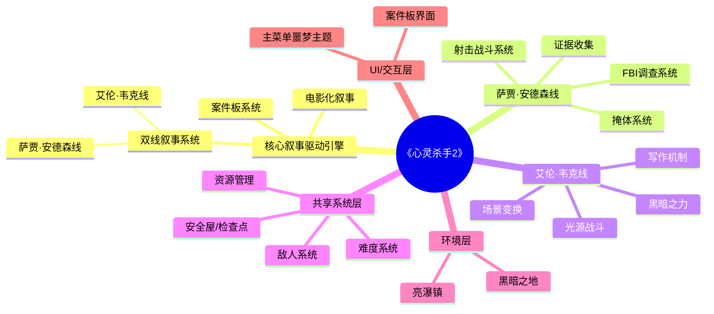
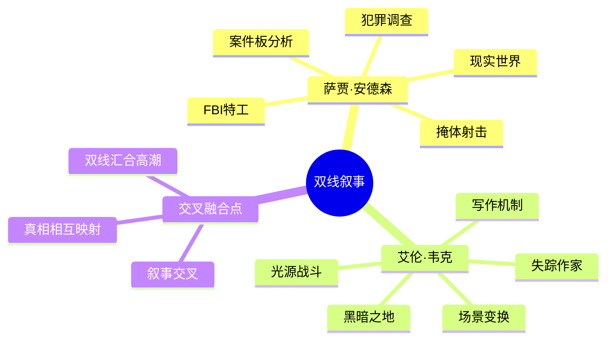
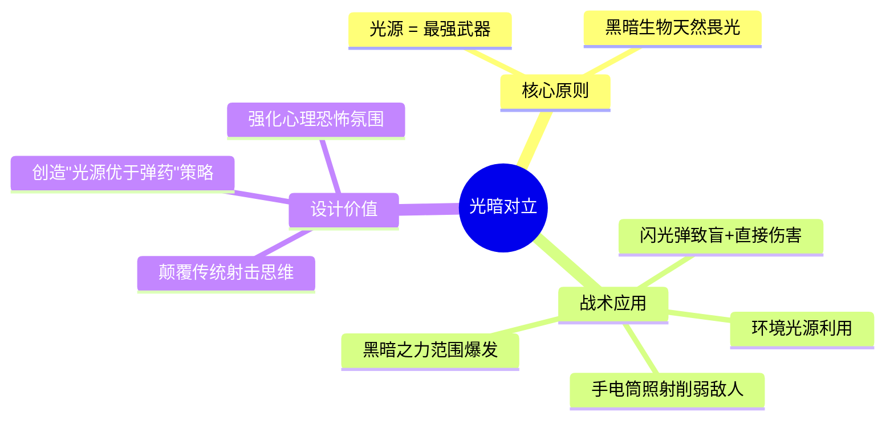
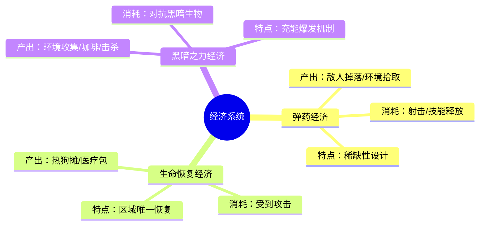
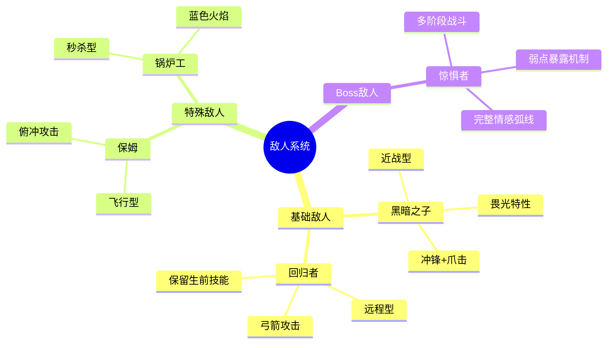
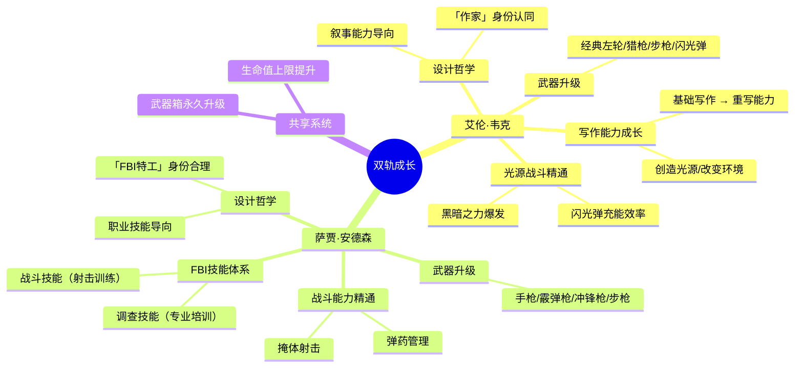
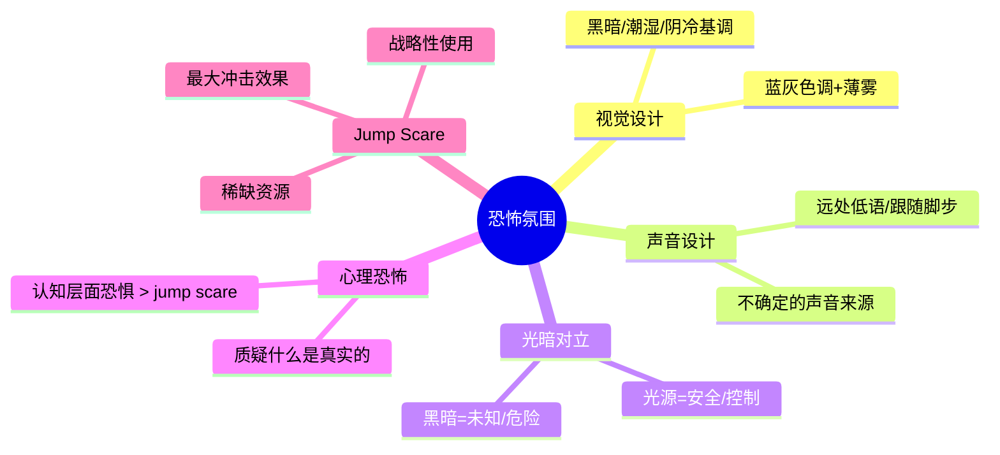
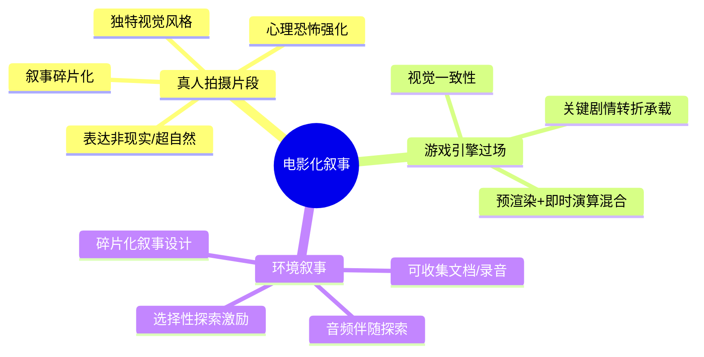
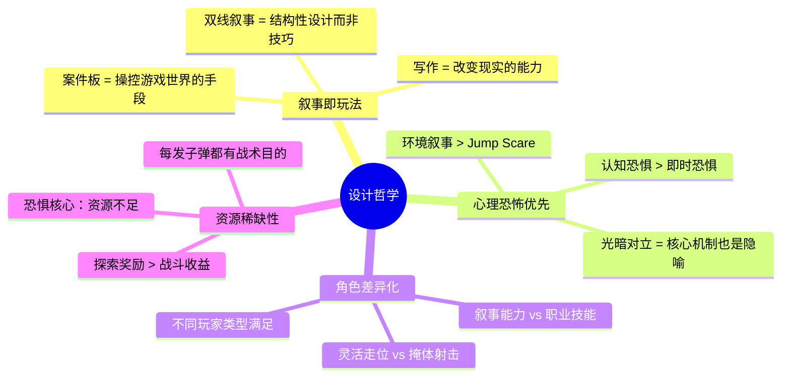

# 《心灵杀手2》游戏系统完整拆解

**游戏名称**：Alan Wake 2 / 心灵杀手2
**开发商**：Remedy Entertainment
**发行商**：Epic Games
**发售日期**：2023年10月
**游戏类型**：动作冒险 / 第三人称射击 / 心理恐怖生存

---

## 一、游戏系统架构图

### 1.1 总体架构思维导图

### 1.2 双线叙事架构

### 1.3 核心系统关系图

**架构设计理念**：

游戏采用分层架构设计，核心层为叙事驱动引擎，所有系统都服务于叙事核心。

| 层级 | 功能 | 设计意图 |
|------|------|----------|
| 核心层 | 双线叙事、案件板、电影化叙事 | 构建"叙事即玩法"的体验基础 |
| 角色层 | FBI调查/写作机制 | 差异化双主角体验 |
| 共享层 | 敌人/资源/难度 | 保证双线共享核心体验 |
| 环境层 | 亮瀑镇/黑暗之地 | 世界构建与氛围营造 |
| UI层 | 主菜单/案件板 | 交互界面与沉浸感 |

---

## 二、游戏核心玩法分析

### 2.1 双主角系统设计

#### 萨贾·安德森（FBI调查线）

**角色定位**：理性、逻辑、科学调查方法的代表

| 特性 | 设计实现 |
|------|----------|
| 身份背景 | FBI特工，妹妹与艾伦事件有关联 |
| 调查工具 | FBI标准程序：勘察、问询、数据库查询 |
| 核心玩法 | 证据收集 → 案件板分析 → 推进剧情 |
| 战斗风格 | 掩体射击，职业化战术作战 |

**设计意图**：通过FBI标准作业程序，让玩家体验专业犯罪调查的沉浸感。

#### 艾伦·韦克（黑暗之地写作线）

**角色定位**：元叙事角色，叙事力量的核心载体

| 特性 | 设计实现 |
|------|----------|
| 身份背景 | 失踪13年的惊悚小说作家 |
| 核心能力 | "写作让故事成真"——通过输入词汇改变现实 |
| 核心玩法 | 天使灯台机制、场景变换谜题、写作解谜 |
| 战斗风格 | 灵活走位，光源武器，无掩体系统 |

**设计意图**："作家"身份认同，让玩家参与"叙事如何影响现实"的元叙事实验。

### 2.2 战斗系统

#### 光暗对立核心机制

#### 武器系统差异

| 武器类型 | 萨贾 | 艾伦 | 核心差异 |
|----------|------|------|----------|
| 手枪 | 标准配枪，均衡型 | 经典左轮，6发，高伤害 | 萨贾重效率，艾伦重精准 |
| 霰弹枪 | 近战AOE | 猎枪，2发，近战核心 | 弹容量差异体现资源压力 |
| 冲锋枪 | 高射速 | 无 | 艾伦无此武器 |
| 步枪 | 精确射击 | 全自动步枪 | 相同定位，不同手感 |
| 特殊 | 无 | 闪光弹，致盲+伤害 | 艾伦专属核心机制 |

**数值设计分析**：

- 弹药稀缺性遵循`五特性模型`：弹药生成受限、消耗快、无成长性（固定掉落）、变化多（敌人掉落）、联系紧（与光源系统联动）
- 闪光弹作为特殊弹药，采用`正态分布`爆率设计，确保关键战斗有资源但不过度充裕

### 2.3 生存资源系统

#### 资源产出与消耗平衡

| 资源类型 | 产出设计 | 消耗场景 | 平衡策略 |
|----------|----------|----------|----------|
| 弹药 | 敌人掉落+环境拾取 | 射击敌人 | 稀缺性设计，刚好够用 |
| 生命值 | 热狗+医疗包 | 敌人攻击 | 区域唯一恢复点 |
| 黑暗之力 | 咖啡+环境收集+击杀充能 | 对抗黑暗生物+Boss战 | 充能机制，爆发输出 |

**经济系统设计遵循`五特性模型`**：
- **生成**：击杀敌人、探索获取
- **成长**：武器箱永久升级（周目内）
- **消亡**：消耗品一次性使用
- **变化**：难度影响资源量
- **联系**：光源系统与闪光弹联动

---

## 三、游戏经济分析

### 3.1 三大经济系统

### 3.2 收集品系统设计

| 收集品 | 功能 | 设计目的 |
|--------|------|----------|
| 热狗 | 生命值恢复 | 纽约街头文化元素，低风险探索奖励 |
| 咖啡 | 黑暗之力/闪光弹充能 | 分布稀疏，战略储备意义 |
| 武器箱 | 永久升级（当前周目） | 隐藏位置，探索成就激励 |
| 线索 | 推进主线剧情 | 案件板分析素材 |

**收集品设计原则**：
- 叙事包装：每一收集品都有世界观的合理性解释
- 双重功能：功能价值 + 探索成就感
- 选择性深度：不影响主线通关，但丰富世界观

### 3.3 难度与经济平衡

| 难度 | 敌人属性 | 资源供给 | 设计定位 |
|------|----------|----------|----------|
| 简单 | 大幅削减 | 充裕 | 专注剧情体验 |
| 普通 | 标准 | 刚好够用 | 默认推荐 |
| 困难 | 提升 | 稀缺 | 寻求挑战 |
| 噩梦 | 极限提升 | 极度稀缺 | 高端玩家 |

**数值平衡方法**：采用`反推法`确定数值方向
- 目标：玩家X级时能完成Y战斗
- 反推：计算所需弹药/生命值
- 验证：通过公式验证可行性

---

## 四、主要系统分析

### 4.1 敌人系统

#### 敌人类型分类

| 敌人类型 | 攻击方式 | 核心弱点 | 设计价值 |
|----------|----------|----------|----------|
| 黑暗之子 | 冲锋+爪击 | 畏光，闪光弹高效 | 教学型敌人，传递光暗对立 |
| 回归者 | 远程弓箭 | 高耐久，需优先击杀 | 增加战术多样性 |
| 保姆 | 俯冲攻击 | 环境触发型 | 垂直维度威胁 |
| 锅炉工 | 接触即死 | 需环境机制消灭 | "必须躲避"心态建立 |
| 惊惧者 | 多阶段攻击 | 阶段转换暴露弱点 | Boss战解谜结合 |

#### Boss战设计

**阶段转换机制**：
- 护盾阶段 → 攻击阶段 → 虚弱阶段
- 触发条件：特定攻击/环境变化/特定道具

**弱点设计原则**：
- 物理性弱点：特定部位更脆弱
- 机制性弱点：攻击后短暂硬直暴露核心
- 环境依赖性弱点：特定光源照射下才受伤害

**战斗节奏设计**：引入→压力积累→高潮→收尾

### 4.2 叙事系统

#### 案件板机制

**核心理念**："叙事即玩法"的具象化体现

| 功能 | 设计实现 |
|------|----------|
| 线索收集 | 物理证据 + 证人陈述 + 照片证据 |
| 时间线构建 | 线索卡片拖放排列 |
| 关联发现 | 相关线索邻近时自动提示 |
| 时空操控 | 选择进入"同一地点的不同时间" |
| 现实改变 | 案件板移动改变当前空间布局 |

**设计意图分析**：
- 将抽象推理过程转化为可视化界面交互
- 玩家主动"构建"叙事而非被动接受
- 具身认知设计增强代入感

#### 双线交叉设计

**交叉点设计**：萨贾发现证据 → 触发艾伦写作灵感
**真相映射**：小说中的虚构事件 ↔ 真实事件扭曲反映
**双线汇合**：游戏高潮双线叙事汇合，"叙事即玩法"主题最终肯定

---

## 五、角色成长规划

### 5.1 双轨成长系统

### 5.2 成长设计哲学

| 设计维度 | 艾伦 | 萨贾 |
|----------|------|------|
| 成长导向 | 叙事能力 | 职业技能 |
| 能力来源 | 故事核心概念 | 职业培训背景 |
| 技能获取 | 剧情自动解锁 | 剧情自动解锁 |
| 武器特点 | 高伤害低弹药 | 均衡配置 |
| 战斗风格 | 光源+灵活走位 | 掩体+战术射击 |

**差异化设计价值**：
- 喜欢深度叙事的玩家 → 偏爱艾伦写作系统
- 喜欢传统动作射击的玩家 → 偏爱萨贾升级体验
- 满足不同类型玩家需求

### 5.3 武器升级路径

| 升级维度 | 萨贾 | 艾伦 |
|----------|------|------|
| 弹药容量 | ✓ | ✓ |
| 射速 | ✓ | ✓ |
| 伤害 | ✓ | ✓ |
| 后坐力控制 | ✓ | ✓ |
| 闪光弹专用 | ✗ | ✓（充能/容量/效果） |

---

## 六、引导相关体验

### 6.1 检查点/安全屋设计

#### 安全屋机制

**核心功能**：
- 敌对真空区域，敌人自动停止追踪
- 状态恢复：生命值、弹药、黑暗之力
- 案件板分析、装备整理空间
- 叙事节奏调节器

**设计理论**：情感曲线管理
- 紧张 → 安全 → 再紧张
- 递进式恐惧加深效应
- 认知层面"理解威胁"机会

#### 自动存档设计

| 设计选择 | 传统恐怖游戏 | 本作 |
|----------|--------------|------|
| 存档方式 | 磁卡/磁带（稀缺资源） | 自动存档 |
| 设计意图 | 存档管理紧张感 | 专注恐怖体验 |
| 玩家自由度 | 需权衡存档时机 | 自由探索无负担 |

**设计意图**：自动存档设计反映了制作团队对恐怖游戏节奏的深刻理解——玩家应专注于体验，而非管理稀缺资源。

### 6.2 恐怖氛围营造

### 6.3 压力释放节奏

**压力积累来源**：
- 黑暗狭窄空间
- 弹药稀缺
- 未知敌人出现
- 追逐序列

**释放机制**：
- 安全屋停顿
- 案件板分析（轻度认知活动）
- 收集品发现带来的成就感

**节奏设计**：安全屋内的轻度活动为下一波恐怖体验做"心理预热"，第二波起点比第一波更高。

### 6.4 新手引导设计

**渐进式教学**：
- 黑暗之子（教学型敌人）→ 传递光暗对立核心
- 简单难度选项 → 让不同玩家找到合适入口
- 早期安全屋 → 建立"压力释放点"认知
- FBI训练任务 → 熟悉操作，不强制

---

## 七、游戏交互分析

### 7.1 UI/界面设计

#### 主菜单 Nightmare 主题设计

**设计理念**：主菜单本身即是"噩梦空间"

| 元素 | 设计实现 |
|------|----------|
| 视觉风格 | 充满不安氛围的噩梦空间 |
| 功能保留 | Logo + 开始按钮 |
| 叙事功能 | 正式进入前已沉浸恐怖美学 |
| 创新点 | UI设计与游戏主题深度融合 |

### 7.2 电影化叙事手法

**各叙事手法设计价值**：

| 手法 | 适用场景 | 设计意图 |
|------|----------|----------|
| 真人拍摄 | 超现实/精神异常状态 | 打破游戏与现实界限 |
| 游戏引擎过场 | 关键剧情转折 | 流畅过渡，维持沉浸 |
| 环境叙事 | 背景故事/世界观 | 奖励深度探索玩家 |

### 7.3 关卡设计原则

#### 黑暗之地设计

| 设计维度 | 实现方式 |
|----------|----------|
| 空间逻辑 | 情感逻辑 > 物理逻辑 |
| 场景变换 | 天使灯台吸收/释放光源 |
| 循环结构 | 循环-螺旋运作，暗示被困 |
| 主题表达 | "重写故事才能逃离"隐喻 |

#### 亮瀑镇设计

| 设计维度 | 实现方式 |
|----------|----------|
| 地域风格 | 太平洋西北真实参照 |
| 创伤后遗症 | 13年前事件痕迹无处不在 |
| 神秘主义 | 古老传说+超自然失踪 |
| 标志性地点 | 咖啡湖、警局、教堂 |

#### 箱庭式关卡结构

**章节独立的微型世界**：
- 高度定制化体验
- 场景变换谜题边界清晰
- 不同时长/规格内容一致性

**箱庭连接设计**：叙事 + 案件板机制 = 松散结构紧凑叙事

---

## 八、总结

### 8.1 设计哲学提炼

### 8.2 创新点分析

| 创新维度 | 具体实现 | 行业价值 |
|----------|----------|----------|
| 案件板系统 | 将推理过程转化为游戏机制 | "叙事即玩法"范式 |
| 双线叙事架构 | 叙事与机制深度融合 | 结构化叙事设计 |
| 光暗对立机制 | 武器系统与世界观统一 | 核心机制隐喻化 |
| 安全屋理念 | 情感曲线管理工具 | 恐怖游戏节奏设计 |
| 写作机制 | "让故事成真"的游戏化 | 元叙事设计典范 |

### 8.3 设计借鉴价值

**对游戏策划的启示**：

1. **叙事与玩法的统一**：不是"叙事驱动"而是"叙事即玩法"
2. **核心机制的多重价值**：光暗对立 = 战斗机制 + 世界观隐喻 + 恐怖氛围
3. **稀缺性设计**：恐惧来源于资源不足，而非敌人强大
4. **情感曲线管理**：安全屋是恐怖游戏的"心率恢复"设计
5. **角色差异化**：双轨成长满足不同玩家需求

**可借鉴的设计模式**：

| 模式 | 适用场景 | 借鉴要点 |
|------|----------|----------|
| 案件板机制 | 调查/解谜游戏 | 推理过程可视化 |
| 双轨叙事 | 多主角游戏 | 差异化体验+叙事交织 |
| 核心机制隐喻 | 所有游戏 | 世界观与机制深度融合 |
| 安全屋设计 | 恐怖/生存游戏 | 情感节奏调节器 |

---

## 附录：图表索引

### draw.io 图表文件

- [游戏系统架构图](diagrams/drawio/alan_wake_2_game_system_architecture.drawio)
- [核心玩法系统关系图](diagrams/drawio/alan_wake_2_core_gameplay.drawio)
- [敌人类型分类图](diagrams/drawio/alan_wake_2_enemy_types.drawio)
- [资源系统流程图](diagrams/drawio/alan_wake_2_resource_flow.drawio)
- [角色成长路径图](diagrams/drawio/alan_wake_2_character_progression.drawio)

---

*文档版本：v2.0*
*分析视角：资深游戏策划*
*参考框架：Arshis-Game-Design-Pro 游戏设计方法论*
