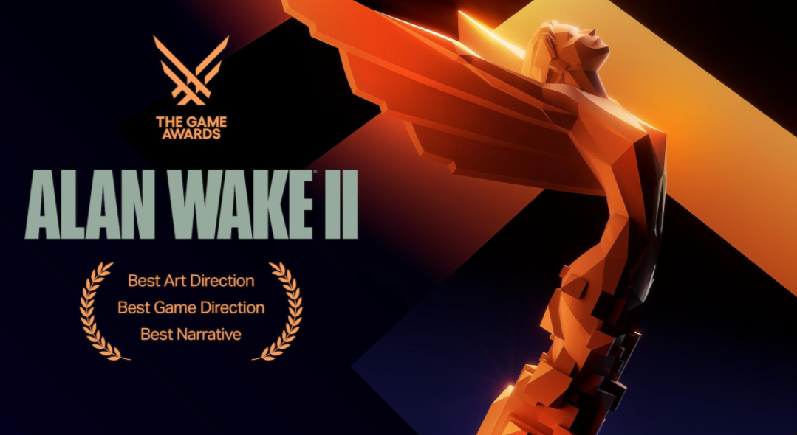

# 《心灵杀手2》拆解

# 一、基础介绍

《心灵杀手2》是一款由Remedy Entertainment开发的动作冒险类的第三人称射击心理恐怖生存游戏，以其独特的写实和抽象相结合的小镇疑云美学和悬疑推理为主的剧情所著称，玩家会在主线流程中扮演两个主角——FBI特工萨贾·安德森和迷失在黑暗之地13年的作家阿兰·韦克，沿着游戏主线的双线叙事剧情进行推进，这是一款典型的美术和剧情（电影化叙事）部分大于游戏性的次世代3A大作；

Remedy Entertainment所开发的游戏一直倾向于具有”电影化叙事“的氛围体验，即将现实的视觉表达与游戏这种虚拟表达相结合，将电影那种极具冲击力的视觉效果与游戏的强代入感的交互方式相结合，从《马克思·佩恩》那极具创新的”子弹时间“的效果实现以及使用实拍照片来描改成漫画的过场方式，到《量子破碎》直接把由真人扮演的美剧直接插入到游戏的主线剧情中，《心灵杀手1》和《控制》也使用了一些由真人拍摄的小剧场来作为游戏的宣发物料，《心灵杀手2》更进一步，直接把真人拍摄放进游戏实实在在的游玩过程中，在一些关键的关卡触发点和章节过场会出现由真人拍摄的贴片作为幻觉元素和提示元素，增强游玩体验和推进游戏进程。

# 二、“黑暗之地”的玩法与环境构建

《心灵杀手》系列的其中一个基础设定是——“黑暗之地”会影响像阿兰韦克这样的艺术家，使其创作的作品”成真“；而游戏开发有时候会让人感到困惑和迷失方向，像是迷失在黑夜中，就像《心灵杀手》中的主角阿兰韦克，因为自己的作家身份迷失在了“黑暗之地”，同时也在努力利用自己的文学写作会”成真“的特性来找到方向逃离“黑暗之地”，也反应了如果我们作为开发者，该如何通过寻找一些光明，来摆脱开发过程中的黑暗处境，并让游戏成真。

游戏中的黑暗之地是一个巨大的箱庭关卡，玩家会在游戏剧情中反复出入这个大箱庭，其中布满了不同的空间谜题；黑暗之地的构建基本分为以下三个方面：游戏创意方向，为创意方向而实施的视觉解决方案，以及如何用技术实现创意方案。

# 三、确定游戏创意方向

## 1、故事基础

《心灵杀手2》是一款动作冒险类的第三人称射击心理恐怖生存游戏，玩家会扮演两个主角——FBI特工萨贾·安德森和迷失在黑暗之地13年的作家阿兰·韦克；在游戏中，玩家主要探索两个不同的世界，一个是设定在太平洋西北地区的现实世界，另一个是充满幻象与邪恶的”黑暗之地/噩梦维度“。

## 2、氛围营造

建立一个宏大且可信的世界的基础是一个优秀的故事，“黑暗之地”的创意来源于Remedy的一位总监山姆·雷克写的剧本，从Remedy的游戏作品历史来看，设定和叙事一直是Remedy主心骨，一个好的故事可以创造出一个独特的、独属于这个世界观的独特氛围体验，让玩家（读者）沉浸其中；

<aside>
💡

“黑暗之地是一个噩梦维度，它是黑暗能量的源泉，可以让艺术成真，它使得梦想和噩梦成真”——【启程】黑暗之地第一章

</aside>

## 3、架构建立

设定上韦克是一个写硬派犯罪小说的作家，而“亚历克斯·凯西”是他书中的一个主角，Remedy的开发团队所做的，是将阿兰·韦克的小说中哪个肮脏危险的纽约市氛围给重现出来，但并不是完全复制真实的纽约市，这个虚拟的二创纽约市必须让人感觉是一个噩梦，潮湿、阴冷、黑暗，Remedy想要创造一个符合《心灵杀手》叙事的虚构纽约，这些都是这个黑暗之地的架构的一部分。

所以黑暗之地的本质其实是阿兰·韦克内心世界的扭曲具象化的外在体现，而黑暗之地可以理解为一种阿兰精神的架构。

## 4、噩梦之感

同时，因为我们被困在这个恐怖故事里，所以黑暗之地给人的感觉必须是恐怖的，一个循环的噩梦维度，黑暗之地会以循环和螺旋的方式运作，阿兰·韦克试图重写他的故事来逃离黑暗之地，而他必须让恐怖成真，才能逃离黑暗之地，他被困住和迷失在自己的噩梦之中。

<aside>
💡

- 纽约肮脏危险
- 纽约像个噩梦
- 黑暗之地是精神构造
- 让噩梦成真
</aside>

# 四、规划视觉效果方案

## 1、如何建立黑暗之地的氛围感？

在建立了游戏的创意方向后，就需要考虑如何在视觉上实现这些方案，需要创造出一种氛围，以及一个由阿兰·韦克精神体构建出的世界。

该如何开始构建这种氛围？

首先可以以故事为起点，开始我们对于黑暗（Darkness）概念的研究，

然后需要对纽约市做些研究，但不仅仅是停留在简单的图像搜索之上，想要还原出纽约这个大城市的特征就需要深入挖掘并学习这个地方的历史，同时也有大量的相关的电影和书籍来研究。

我们可以通过游戏最终给出的城市场景来反推Remedy是如何确定纽约市的一些最具标志性的元素，那些可以被识别为大城市原型的元素，而这些元素有时可以是巨大桥梁、可以是黑暗的小巷，可以是高架铁轨以及高楼大厦；还有那些属于纽约的集体记忆，涂鸦、滑板、街头和披萨店，Remedy的团队想要做的就是窃取这些文化记忆，然后用它们来构建这个虚拟世界，这些文化记忆可以来自电影、漫画、摄影以及其他媒介，例如很标志性的《小丑》和很经典的斯科塞斯的电影《出租车司机》；通过这些搜集来的各自文化记忆的元素，创建一个巨大的参考板块，通过这些元素，在我们的脑海中形成一个新版本的、虚构的纽约；

研究和想法可以运用进黑暗之地的原型demo，虚构城市的建立需要不断修改，来找到最合适的比例、规模和轮廓；在制作前期，不断探索氛围的感觉，建立原型，并寻找将叙事和游戏性融为一体的方法，同时也要尝试弄清该如何构建黑暗之地。

- 概念验证
    - 氛围探索
    - 构建原型
    - 融合叙事和游戏性

为了更好的理解这个工作流程，需要经历一个阶段门的过程，在执行阶段确定战略目标，然后在概念阶段确定出具体的设计方案，这是由编剧、主美和游玩策划合作出的产物，来决定黑暗之地的运作方式，同时确保叙事、美术和游戏性相互配合，相互支持；最后在概念验证阶段利用这个高层次的设计方案来开始搭建世界观，将其转化成可游玩的Demo版本，以此来证明游戏是有趣且可行的，但同时也需要关注其中出现的风险和创新。

通过早期的概念图，来探索不同的想法，例如在《心灵杀手1》的结尾，阿兰·韦克跳入了“巨斧湖”，来到了黑暗之地，则“水”是游戏里的其中一个主题，想办法在游戏中以不同的形式去表达，所以从水下视觉的概念图中汲取灵感，但同时我们也要黑暗之地看起来像是一个现实里的城市，最终，这种在水下的感觉可以通过实际画面的视觉效果和物品表面材料的特效处理来呈现，同时也决定了让黑暗之地一直在下雨；

为了验证概念，可以搭一个类似纽约城市结构的十字路口街景Demo，想要创造出能够被一眼认出是纽约的元素，Demo就是我们的游乐场，在其中进行实验，不停地去失败；

## 2、玩法概念——天使灯台

黑暗之地关卡中的其中一个玩法是使用“天使灯台”进行场景变换，来达到推进解开关卡谜题的目的，玩家操控阿兰韦克会在黑暗之地这个大箱庭中遇到一些类似路灯的“固定光源”，在经过按键交互后，当前解谜部分的场景会变换，并且路灯的光源会被天使台灯吸收，变成一个在台灯内的不稳定光源，当下一次玩家回到这个触发点或者黑暗之地箱庭下的其他无光源的触发点时，玩家可以进行交互，将天使台灯中的不稳定光源放归到类似路灯这样的载体中，使其变回固定光源，同时关卡谜题中的场景进行二次变换；

游戏过程中，玩家往往需要反复变换场景，通过场景中的线索来找到解谜的关键。

## 3、玩法概念——案件板

案件板是创作者常用的一个工具，创作者通常会使用类似黑板或者白板这样的道具，把他们对于作品的想法、灵感等内容放在上面，以辅助自己的作品创作。

而在游戏中，玩家会通过收集线索和推进游戏剧情来完善案件板，而同时又通过案件板来推进游戏，玩家可以通过移动案件板上的线索，来篡改游戏中的现实，即当前的小箱庭场景，进入到同一地点的不同时间段，也起到推进游戏剧情的目的。

<aside>
💡

- 城市的原型
- 纽约的集体记忆
- 
</aside>

# 五、技术实现方案